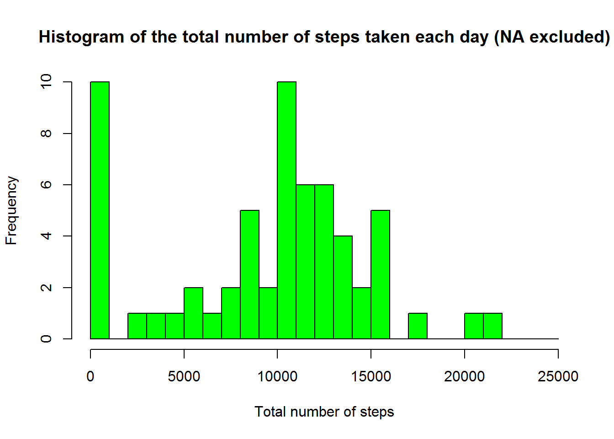
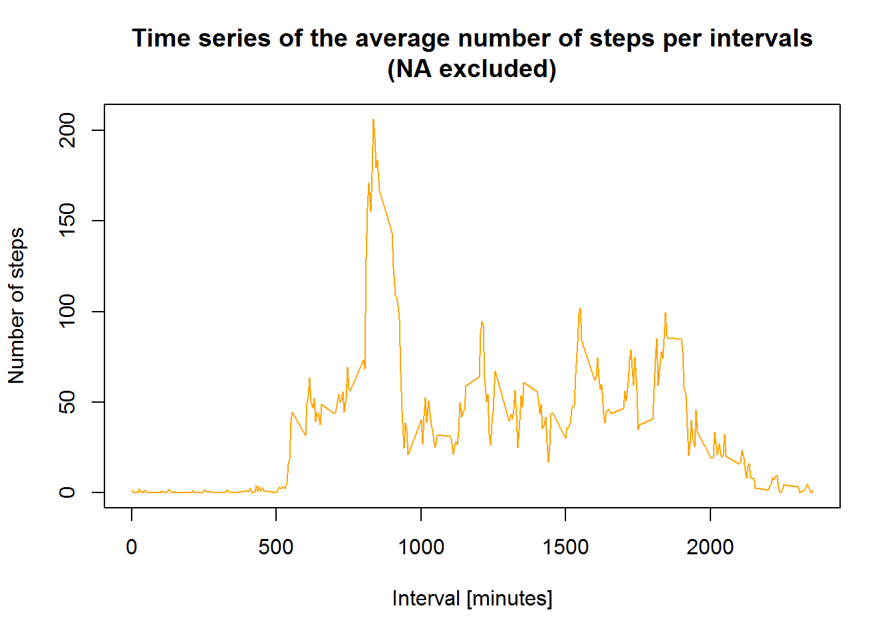
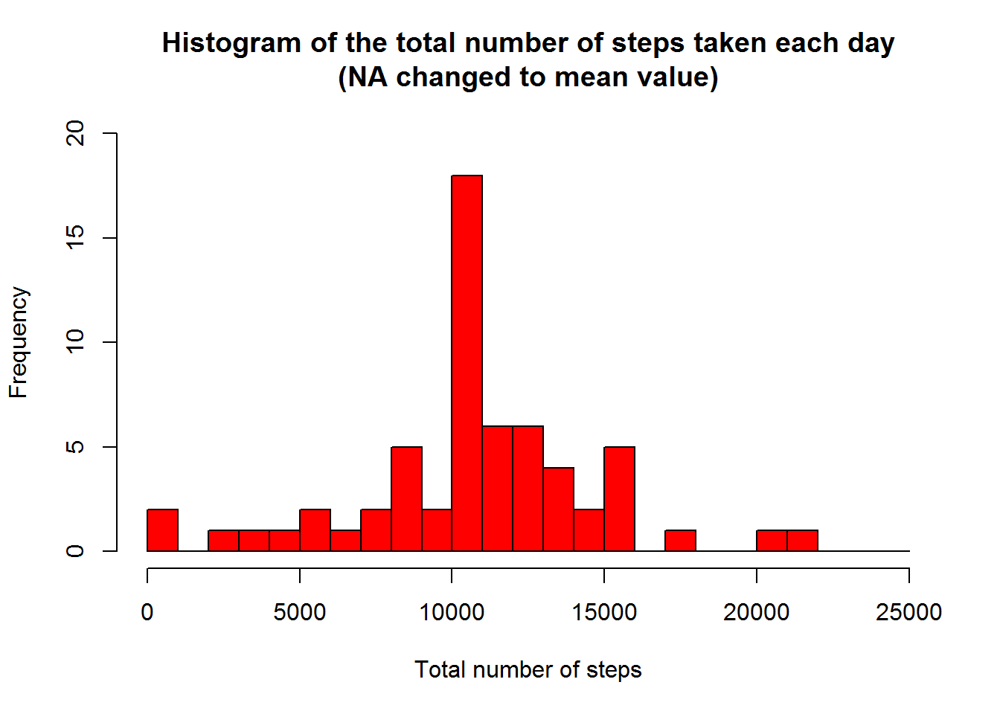
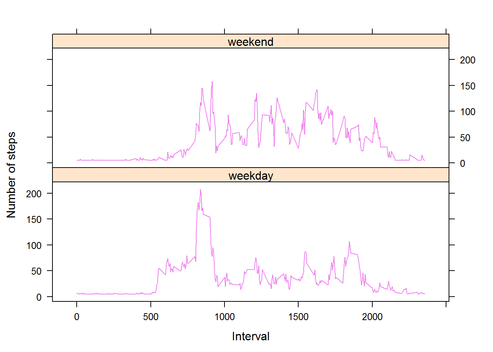

# Reproducible Research: Peer Assessment 1
Michał Maliszewski  
8 stycznia 2016  

## Introduction

It is now possible to collect a large amount of data about personal movement using activity monitoring devices such as a Fitbit, Nike Fuelband, or Jawbone Up. These type of devices are part of the “quantified self” movement – a group of enthusiasts who take measurements about themselves regularly to improve their health, to find patterns in their behavior, or because they are tech geeks. But these data remain under-utilized both because the raw data are hard to obtain and there is a lack of statistical methods and software for processing and interpreting the data.

This assignment makes use of data from a personal activity monitoring device. This device collects data at 5 minute intervals through out the day. The data consists of two months of data from an anonymous individual collected during the months of October and November, 2012 and include the number of steps taken in 5 minute intervals each day.


## Data 

The data for this assignment can be downloaded from the course web site:

Dataset: [Activity monitoring data](https://d396qusza40orc.cloudfront.net/repdata%2Fdata%2Factivity.zip) [52K]
The variables included in this dataset are:

steps: Number of steps taking in a 5-minute interval (missing values are coded as NA)

date: The date on which the measurement data was taken in YYYY-MM-DD format

interval: Identifier for the 5-minute interval in which measurement was taken

The dataset is stored in a comma-separated-value (CSV) file and there are a total of 17,568 observations in this dataset.

## Assignment

This assignment will be described in multiple parts. You will need to write a report that answers the questions detailed below. Ultimately, you will need to complete the entire assignment in a **single R markdown** document that can be processed by **knitr** and be transformed into an HTML file.

Throughout your report make sure you always include the code that you used to generate the output you present. When writing code chunks in the R markdown document, always use echo = TRUE so that someone else will be able to read the code. **This assignment will be evaluated via peer assessment so it is essential that your peer evaluators be able to review the code for your analysis.**

For the plotting aspects of this assignment, feel free to use any plotting system in R (i.e., base, lattice, ggplot2).

Fork/clone the [GitHub repository created for this assignment](http://github.com/rdpeng/RepData_PeerAssessment1). You will submit this assignment by pushing your completed files into your forked repository on GitHub. The assignment submission will consist of the URL to your GitHub repository and the SHA-1 commit ID for your repository state.

NOTE: The GitHub repository also contains the dataset for the assignment so you do not have to download the data separately.

## Loading and preprocessing the data

### 1. Load the data (i.e. read.csv())

```r
activityRaw <- read.csv("activity.csv")
```

### 2. Process/transform the data (if necessary) into a format suitable for your analysis

```r
#Format date attribute
activityRaw$date <- as.POSIXct(activityRaw$date, format="%Y-%m-%d")

#Add days of the week basing on date attribute
activityRaw <- data.frame(date=activityRaw$date, weekday=tolower(weekdays(activityRaw$date)), steps=activityRaw$steps, interval=activityRaw$interval)

#Check if day is a part of weekend or is a weekday (Note that names of the days are in native language - in this case polish)
activityRaw <- cbind(activityRaw, daytype=ifelse(activityRaw$weekday == "sobota" | activityRaw$weekday == "niedziela", "weekend", "weekday"))

#Create a frame with additional day type column
activity <- data.frame(date=activityRaw$date, daytype=activityRaw$daytype, interval=activityRaw$interval, steps=activityRaw$steps)
```


## What is the mean total number of steps taken per day?

For this part of the assignment, you can ignore the missing values in the dataset.

### 1. Make a histogram of the total number of steps taken each day

```r
#Calculate the total number of steps per day (NA values are not included)
stepsPerDay <- aggregate(activity$steps, by=list(activity$date), FUN=sum, na.rm=TRUE)

#Rename attributes
names(stepsPerDay) <- c("Date", "Total")
```
Check the result after renaming:

```r
head(stepsPerDay)
```

```
##         Date Total
## 1 2012-10-01     0
## 2 2012-10-02   126
## 3 2012-10-03 11352
## 4 2012-10-04 12116
## 5 2012-10-05 13294
## 6 2012-10-06 15420
```
Now it's time to create histogram:

```r
#Check the maximum value
max(stepsPerDay$Total)
```

```
## [1] 21194
```

```r
#Compute the hitogram with step 1000 and range 0 - 25000
hist(stepsPerDay$Total, main="Histogram of the total number of steps taken each day (NA excluded)", xlab="Total number of steps", col="green", breaks=seq(from=0, to=25000, by=1000))
```

 

### 2. Calculate and report the **mean** and **median** total number of steps taken per day

```r
#Mean value
mean(stepsPerDay$Total)
```

```
## [1] 9354.23
```

```r
#Median value
median(stepsPerDay$Total)
```

```
## [1] 10395
```
Calculated mean is around **9354** and median is **10395**

## What is the average daily activity pattern?

### 1. Make a time series plot (i.e. type = "l") of the 5-minute interval (x-axis) and the average number of steps taken, averaged across all days (y-axis)


```r
#The means of steps for each interval in all days
meanData <- aggregate(activity$steps, by=list(activity$interval), FUN=mean, na.rm=TRUE)

#Rename attributes
names(meanData) <- c("interval", "mean")

#Generate time series plot
plot(meanData$interval, meanData$mean, type="l", col="orange", xlab="Interval [minutes]", ylab="Number of steps", lwd=1, main="Time series of the average number of steps per intervals\n(NA excluded)")
```

 

### 2. Which 5-minute interval, on average across all the days in the dataset, contains the maximum number of steps?

```r
#Position of the maximum mean value
maxPosition <- which(meanData$mean == max(meanData$mean))

#The value of the interval at given position
maxInterval <- meanData[maxPosition, 1]
maxInterval
```

```
## [1] 835
```
The 5-minute interval with maximum number of steps across all days is **835**.

## Imputing missing values

Note that there are a number of days/intervals where there are missing values (coded as `NA`). The presence of missing days may introduce bias into some calculations or summaries of the data.

### 1. Calculate and report the total number of missing values in the dataset (i.e. the total number of rows with `NA`'s)

```r
#Calcualting number of NA values with is.na function
naNumber <- sum(is.na(activity$steps))
```
Total count of `NA` is **2304**.

### 2. Devise a strategy for filling in all of the missing values in the dataset. The strategy does not need to be sophisticated. For example, you could use the mean/median for that day, or the mean for that 5-minute interval, etc.

```r
#Localize NA positions
naPositions <- which(is.na(activity$steps))

#Create mean vector
meanVector <- rep(mean(activity$steps, na.rm=TRUE), times=length(naPositions))
```
Used strategy replacing `NA` values with the **mean steps** value.

### 3. Create a new dataset that is equal to the original dataset but with the missing data filled in.

```r
#Replace NA in activity frame
activity[naPositions, "steps"] <- meanVector

#Check the result
head(activity)
```

```
##         date daytype interval   steps
## 1 2012-10-01 weekday        0 37.3826
## 2 2012-10-01 weekday        5 37.3826
## 3 2012-10-01 weekday       10 37.3826
## 4 2012-10-01 weekday       15 37.3826
## 5 2012-10-01 weekday       20 37.3826
## 6 2012-10-01 weekday       25 37.3826
```

### 4. Make a histogram of the total number of steps taken each day and Calculate and report the **mean** and **median** total number of steps taken per day. Do these values differ from the estimates from the first part of the assignment? What is the impact of imputing missing data on the estimates of the total daily number of steps?

```r
#Same as before, but this time with replaced NA values
stepsPerDayWithReplace <- aggregate(activity$steps, by=list(activity$date), FUN=sum)

#Rename attributes
names(stepsPerDayWithReplace) <- c("date", "total")

#Histogram after fiew tries with X,Y ranges, increasing again by 1000
hist(stepsPerDayWithReplace$total, breaks=seq(from=0, to=25000, by=1000), col="red", ylim=c(0, 20), xlab="Total number of steps", main="Histogram of the total number of steps taken each day\n(NA changed to mean value)")
```

 

Calculating mean and median values:

```r
#Mean value
mean(stepsPerDayWithReplace$total)
```

```
## [1] 10766.19
```

```r
#Median value
median(stepsPerDayWithReplace$total)
```

```
## [1] 10766.19
```
After filling `NA` values mean and median values are around **10766** and they are different (higher) than the results from first part of assignment (where mean was **9354** and median was **10395**). It's mean that generating more data using mean/median value instead some special sophisticated methods provides to increase total mean/median value.

## Are there differences in activity patterns between weekdays and weekends?

For this part the weekdays() function may be of some help here. Use the dataset with the filled-in missing values for this part.

### 1. Create a new factor variable in the dataset with two levels - “weekdays” and “weekend” indicating whether a given date is a weekday or weekend day.
We already have a data set with day type attribute, so we will use it:

```r
head(activity)
```

```
##         date daytype interval   steps
## 1 2012-10-01 weekday        0 37.3826
## 2 2012-10-01 weekday        5 37.3826
## 3 2012-10-01 weekday       10 37.3826
## 4 2012-10-01 weekday       15 37.3826
## 5 2012-10-01 weekday       20 37.3826
## 6 2012-10-01 weekday       25 37.3826
```

### 2. Make a panel plot containing a time series plot (i.e. type = "l") of the 5- minute interval (x-axis) and the average number of steps taken, averaged across all weekday days or weekend days (y-axis).

```r
#Lattice library can be useful
library(lattice)

#Calculating averange number of steps taken, depends of day type
meanData <- aggregate(activity$steps, by=list(activity$daytype, activity$interval), mean)

#Rename attributes
names(meanData) <- c("daytype", "interval", "mean")

#Compute the time series plot
xyplot(mean ~ interval | daytype, meanData, type="l", lwd=1, xlab="Interval", ylab="Number of steps", col="violet", layout=c(1,2))
```

 
